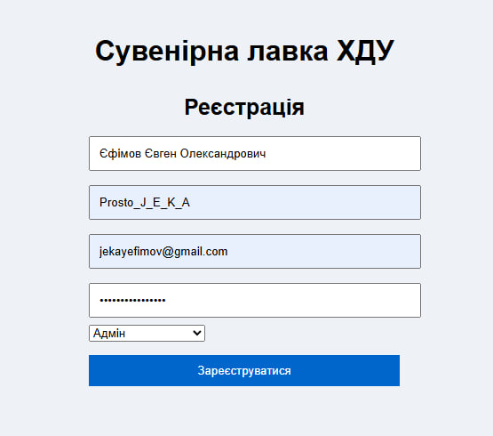
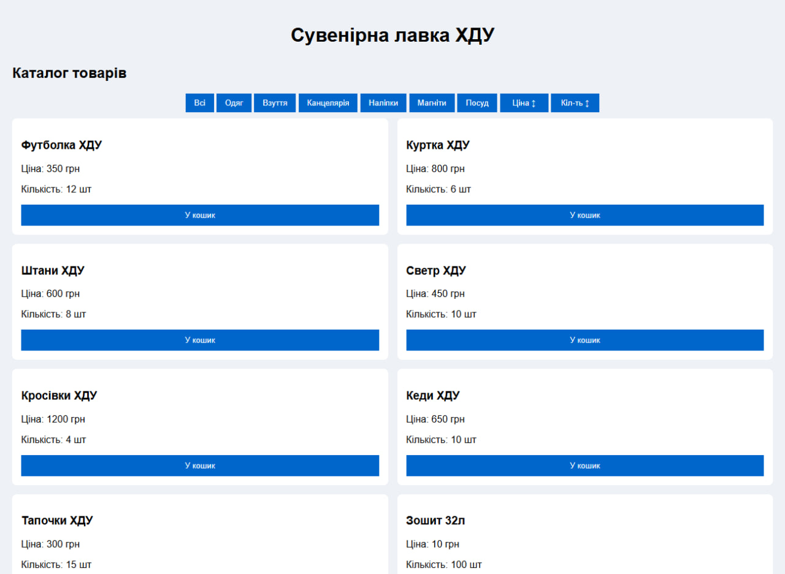

# Frontend: Інтерфейс користувача

## 1. Вступ

Frontend для проєкту **KSU GiftShop — Сувенірна лавка ХДУ** реалізовано у вигляді простого HTML/CSS/JS-прототипу.  
Мета — показати основні UI-елементи та їх інтеракцію з backend (реєстрація користувача, завантаження каталогу, фільтрація та сортування товарів).

Компоненти:
- Форма реєстрації (поле ФІО, username, email, пароль, роль)
- Каталог товарів (картки товарів)
- Панель фільтрів (категорії)
- Кнопки сортування (ціна, кількість)

---

## 2. Wireframe
### Екран «Реєстрація»: поля для ФІО, username, email, пароль, select для ролі, кнопка «Зареєструватися».


### Екран «Каталог»: панель фільтрів товарів, кнопки сортування, сітка карток товарів.


---

## 3. Код

### index.html

```html
<!DOCTYPE html>
<html lang="uk">
<head>
    <meta charset="UTF-8">
    <meta name="viewport" content="width=device-width, initial-scale=1.0">
    <title>Сувенірна лавка ХДУ</title>
    <link rel="stylesheet" href="styles.css">
</head>
<body>

<header>
    <h1>Сувенірна лавка ХДУ</h1>
</header>

<main>
    <!-- Блок: Реєстрація -->
    <section id="register">
        <h2>Реєстрація</h2>
        <form id="regForm">
            <input type="text" id="full_name" placeholder="ФІО" required>
            <input type="text" id="username" placeholder="Ім'я користувача" required>
            <input type="email" id="email" placeholder="Email" required>
            <input type="password" id="password_hash" placeholder="Пароль">
			<select id="role">
				<option value="admin">Адмін</option>
				<option value="manager">Менеджер</option>
				<option value="seller">Продавець</option>
				<option value="warehouse">Працівник складу</option>
				<option value="supplier">Постачальник</option>
			</select>
			
            <button type="submit" class="register-btn">Зареєструватися</button>
        </form>
    </section>

    <!-- Блок: Каталог (показується після реєстрації) -->
	<section id="catalog" style="display:none;">
		<h2>Каталог товарів</h2>
		
		<div id="filters">
			<button onclick="filterCatalog('all')">Всі</button>
			<button onclick="filterCatalog('одяг')">Одяг</button>
			<button onclick="filterCatalog('взуття')">Взуття</button>
			<button onclick="filterCatalog('канцелярія')">Канцелярія</button>
			<button onclick="filterCatalog('наліпки')">Наліпки</button>
			<button onclick="filterCatalog('магніти')">Магніти</button>
			<button onclick="filterCatalog('посуд')">Посуд</button>
			
			<button id="sort-price" class="sort-btn" onclick="sortByPrice()">Ціна ↕</button>
			<button id="sort-quantity" class="sort-btn" onclick="sortByQuantity()">Кіл-ть ↕</button>
		</div>
		
		<div id="items"></div>
	</section>

</main>

<script src="script.js"></script>
</body>
</html>
```

---

### script.js

``` js
document.getElementById('regForm').addEventListener('submit', async (e) => {
    e.preventDefault();

    const full_name = document.getElementById('full_name').value;
    const username = document.getElementById('username').value;
    const email = document.getElementById('email').value;
    const password_hash = document.getElementById('password_hash').value;
	const role = document.getElementById("role").value;


    try {
        const response = await fetch('http://localhost:5000/users/register', {
            method: 'POST',
            headers: {'Content-Type': 'application/json'},
            body: JSON.stringify({ full_name, username, email, password_hash: password_hash, role})
        });

        if (!response.ok) {
            return alert("Помилка реєстрації");
        }

        document.getElementById('register').style.display = 'none';
        document.getElementById('catalog').style.display = 'block';

        loadCatalog('all');

    } catch (error) {
        console.error("Помилка:", error);
    }
});

async function loadCatalog(category = "all") {
    const itemsDiv = document.getElementById('items');

	// Тимчасові дані (до створення API)
	const items = [
		{name: "Футболка ХДУ", price: 350, category: "одяг", quantity: 12},
		{name: "Куртка ХДУ", price: 800, category: "одяг", quantity: 6},
		{name: "Штани ХДУ", price: 600, category: "одяг", quantity: 8},
		{name: "Светр ХДУ", price: 450, category: "одяг", quantity: 10},
		{name: "Кросівки ХДУ", price: 1200, category: "взуття", quantity: 4},
		{name: "Кеди ХДУ", price: 650, category: "взуття", quantity: 10},
		{name: "Тапочки ХДУ", price: 300, category: "взуття", quantity: 15},
		{name: "Зошит 32л", price: 10, category: "канцелярія", quantity: 100},
		{name: "Зошит 48л", price: 15, category: "канцелярія", quantity: 80},
		{name: "Ручка ХДУ", price: 5, category: "канцелярія", quantity: 250},
		{name: "Олівець ХДУ", price: 3, category: "канцелярія", quantity: 300},
		{name: "Маркер ХДУ", price: 20, category: "канцелярія", quantity: 60},
		{name: "Наліпка ХДУ", price: 15, category: "наліпки", quantity: 80},
		{name: "Набір наліпок", price: 40, category: "наліпки", quantity: 45},
		{name: "Стікери ХДУ", price: 25, category: "наліпки", quantity: 70},
		{name: "Магніт ХДУ", price: 35, category: "магніти", quantity: 30},
		{name: "Великий магніт ХДУ", price: 60, category: "магніти", quantity: 20},
		{name: "Магнітний набір ХДУ", price: 80, category: "магніти", quantity: 15},
		{name: "Кружка ХДУ", price: 120, category: "посуд", quantity: 18},
		{name: "Тарілка ХДУ", price: 200, category: "посуд", quantity: 10},
		{name: "Чашка ХДУ", price: 90, category: "посуд", quantity: 25},
		{name: "Склянка ХДУ", price: 70, category: "посуд", quantity: 30},
		{name: "Рюкзак ХДУ", price: 750, category: "аксесуари", quantity: 12},
		{name: "Пенал ХДУ", price: 80, category: "канцелярія", quantity: 50},
		{name: "Блокнот ХДУ", price: 50, category: "канцелярія", quantity: 40},
		{name: "Кепка ХДУ", price: 220, category: "одяг", quantity: 15},
		{name: "Шарф ХДУ", price: 180, category: "одяг", quantity: 20},
		{name: "Ремінь ХДУ", price: 200, category: "одяг", quantity: 10},
		{name: "Поясна сумка ХДУ", price: 300, category: "аксесуари", quantity: 18},
		{name: "Набір фарб", price: 120, category: "канцелярія", quantity: 30},
		{name: "Пензлі", price: 35, category: "канцелярія", quantity: 50},
		{name: "Альбом для малювання", price: 60, category: "канцелярія", quantity: 40},
		{name: "Ланчбокс ХДУ", price: 150, category: "посуд", quantity: 22},
		{name: "Термос ХДУ", price: 400, category: "посуд", quantity: 15},
		{name: "Брелок ХДУ", price: 50, category: "аксесуари", quantity: 60},
		{name: "Сумка для ноутбука", price: 900, category: "аксесуари", quantity: 8},
		{name: "Папка для документів", price: 70, category: "аксесуари", quantity: 35},
		{name: "Маска ХДУ", price: 30, category: "аксесуари", quantity: 100},
		{name: "Антисептик ХДУ", price: 60, category: "аксесуари", quantity: 50},
		{name: "Наклейки для ноутбука", price: 45, category: "наліпки", quantity: 65},
		{name: "Значок ХДУ", price: 25, category: "аксесуари", quantity: 80},
		{name: "Скатертина ХДУ", price: 220, category: "посуд", quantity: 10},
		{name: "Коврик для миші ХДУ", price: 100, category: "аксесуари", quantity: 40},
		{name: "Папка-регістратор", price: 120, category: "канцелярія", quantity: 25},
		{name: "Флешка ХДУ 32GB", price: 250, category: "аксесуари", quantity: 20},
		{name: "Блокнот з логотипом ХДУ", price: 70, category: "канцелярія", quantity: 45},
		{name: "Міні-щоденник", price: 60, category: "канцелярія", quantity: 30},
		{name: "Набір ручок гелевих", price: 30, category: "канцелярія", quantity: 100},
	];


    itemsDiv.innerHTML = '';

    // Фільтрація
    const filteredItems = category === "all" ? items : items.filter(item => item.category === category);

    filteredItems.forEach(item => {
        const card = document.createElement('div');
        card.classList.add('item-card');
        card.innerHTML = `
            <h3>${item.name}</h3>
            <p>Ціна: ${item.price} грн</p>
			<p>Кількість: ${item.quantity} шт</p>
            <button>У кошик</button>
        `;
        itemsDiv.appendChild(card);
    });
}

// Фільтр
function filterCatalog(category) {
    loadCatalog(category);
}

let currentSort = {
    price: "desc",
    quantity: "desc"
};

function sortByPrice() {
    const itemsDiv = document.getElementById('items');
    const cards = Array.from(itemsDiv.children);

    currentSort.price = currentSort.price === "asc" ? "desc" : "asc";

    cards.sort((a, b) => {
        const priceA = parseInt(a.querySelector("p").textContent.replace(/\D/g, ""));
        const priceB = parseInt(b.querySelector("p").textContent.replace(/\D/g, ""));

        return currentSort.price === "asc" ? priceA - priceB : priceB - priceA;
    });

    itemsDiv.innerHTML = "";
    cards.forEach(card => itemsDiv.appendChild(card));
}

function sortByQuantity() {
    const itemsDiv = document.getElementById('items');
    const cards = Array.from(itemsDiv.children);

    currentSort.quantity = currentSort.quantity === "asc" ? "desc" : "asc";

    cards.sort((a, b) => {
        const qA = parseInt(a.querySelectorAll("p")[1].textContent.replace(/\D/g, ""));
        const qB = parseInt(b.querySelectorAll("p")[1].textContent.replace(/\D/g, ""));

        return currentSort.quantity === "asc" ? qA - qB : qB - qA;
    });

    itemsDiv.innerHTML = "";
    cards.forEach(card => itemsDiv.appendChild(card));
}
```

---

### styles.css

``` css
body {
    font-family: Arial, sans-serif;
    background: #eef1f5;
    padding: 20px;
    margin: 0;
}

header {
    text-align: center;
    margin-bottom: 30px;
}

form {
    max-width: 350px;
    margin: auto;
}

input {
    width: 100%;
    padding: 10px;
    margin: 8px 0;
}

button {
    width: 100%;
    padding: 10px;
    background: #0066cc;
    color: white;
    border: none;
    cursor: pointer;
}

button:hover {
    background: #004a99;
}

.register-btn {
    margin-top: 15px;
}

#items {
    display: grid;
    grid-template-columns: repeat(2, 1fr);
    gap: 15px;
}

.item-card {
    background: white;
    padding: 15px;
    border-radius: 8px;
}

#register h2 {
    text-align: center;
    margin-bottom: 10px;
    font-size: 25px;
}

#filters {
    text-align: center;
    margin-bottom: 10px;
}

#filters button {
    width: auto;
    padding: 8px 14px;
}

#sort-price {
	width: 80px !important;
}

#sort-quantity {
    width: 80px !important;
}
```

---
## 5. Інтеграція
### UI викликає backend API:
- POST /users/register — реєстрація користувача (вміст тіла JSON: {full_name, username, email, password_hash, role}).
- В майбутньому: GET /products або GET /products?category=одяг — для завантаження каталогу.
### На сьогодні каталог — статичний масив у script.js. Для повноцінної роботи замінити виклики на fetch-запити до бекенду та обробити CORS (у Flask: flask-cors).

---

## 6. Висновки
- UI охоплює ключові use-cases: реєстрацію та перегляд каталогу із фільтрами й сортуванням.
- Прототип готовий до подальшої інтеграції з backend: для повноцінної роботи достатньо додати GET /products і підключити реальні дані.
