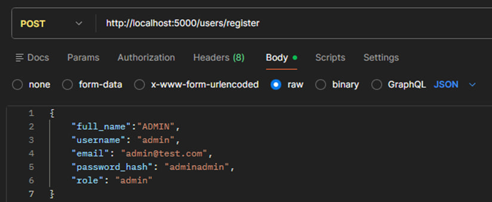
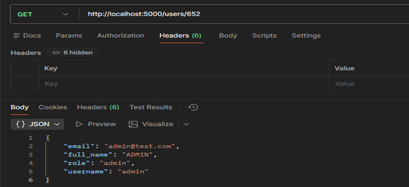
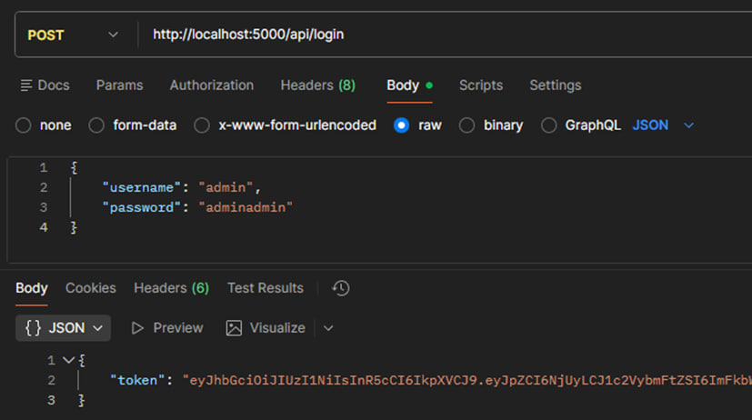
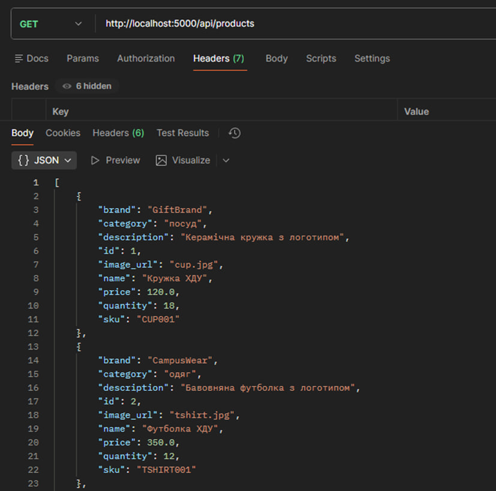
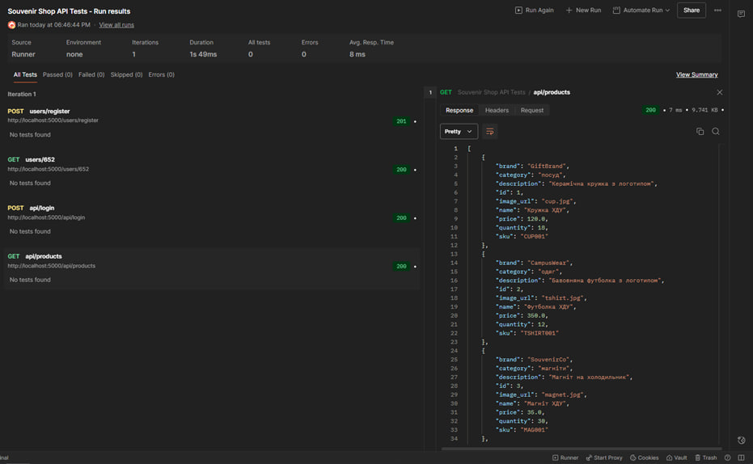
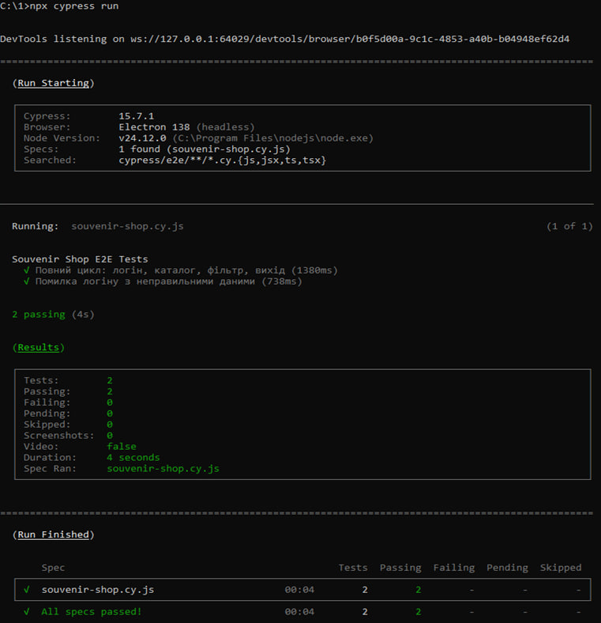

# 1. Вступ:
-	" Інтеграційне тестування (Integration Testing — перевірка взаємодії модулів, як API + БД) та системне (System Testing — end-to-end перевірка всього додатка)"

---

# 2. Теорія:
-	Інтеграційне: "Перевірка зв'язків (наприклад, POST /register → INSERT в БД)". Аналогія: "Колеса + двигун".
-	Системне (E2E): "Повний цикл (клік → результат)". Аналогія: "Їзда машиною".

# 3. Інтеграційні тести (Postman):

* Запит 1: Реєстрація користувача (Backend + БД)



* Запит 2: Відображення нового користувача



* Запит 3: Логін користувача (JWT)



* Запит 4: Отримання каталогу товарів (авторизація + БД)



Результат:



---

# 4. Системні тести (Cypress):

```js
describe('Souvenir Shop E2E Tests', () => {

    it('Повний цикл: логін, каталог, фільтр, вихід', () => {
		
// Arrange: відкрити сайт
        cy.visit('http://localhost:3000/index.html');
		
        // Act: логін
        cy.get('#login_username').type('admin');
        cy.get('#login_password').type('adminadmin');
		cy.get('#loginForm button[type="submit"]').click();
		
        // Assert: каталог відкрився
        cy.get('#catalog').should('be.visible');
        cy.get('#items').children().should('have.length.greaterThan', 0);
		
        // Act: фільтрація
        cy.contains('Одяг').click();
		
        // Assert: товари відфільтровані
        cy.get('#items').children().should('exist');
		
        // Act: сортування за ціною
        cy.get('#sort-price').click();
		
        // Assert: каталог все ще відображається
        cy.get('#items').should('be.visible');
		
        // Act: вихід
        cy.get('.logout-btn').click();
		
        // Assert: повернення на логін
        cy.get('#login').should('be.visible');
    });

    it('Помилка логіну з неправильними даними', () => {
        
        cy.visit('http://localhost:3000/index.html');

        cy.get('#login_username').type('qweasdzxc');
        cy.get('#login_password').type('qweasdzxc');
        cy.get('#loginForm button[type="submit"]').click();

        // Перевірка повідомлення про помилку
        cy.on('window:alert', (text) => {
            expect(text).to.contains('Невірний логін або пароль');
        });

        // Логін форма лишається видимою
        cy.get('#login').should('be.visible');
    });
});
```

Результат:



---

# 5. Висновки:
