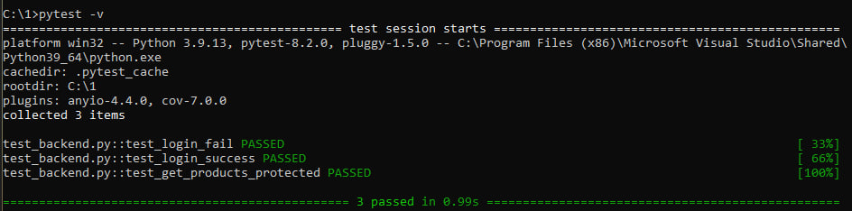
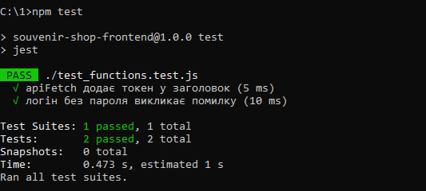
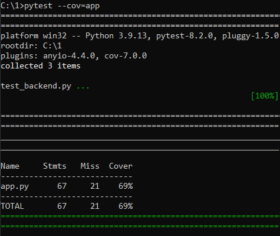

# Тестування: unit-тести

---

## 1. Вступ

У даній роботі реалізовано unit-тестування backend та frontend частин проекту **«Сувенірна лавка ХДУ»**.

Для backend використано фреймворк **pytest**, для frontend - **Jest**.  
Unit-тести дозволяють перевірити коректність роботи окремих компонентів системи (ендпоінтів, функцій) на ранньому етапі розробки.

**Мета тестування** - виявлення помилок на ранніх етапах розробки та перевірка коректної роботи авторизації, захищених API та клієнтської логіки.

---

## 2. Теоретичні відомості

### 2.1 Unit-тестування

**Unit-тест** - це автоматизований тест, який перевіряє окрему частину програми (модуль, функцію, метод, клас, ендпоінт) ізольовано від інших компонентів.

Переваги:
- швидке виявлення помилок;
- безпечний рефакторинг;
- документування поведінки коду;
- підвищення якості програмного забезпечення.

---

### 2.2 Патерн AAA (Arrange – Act – Assert)

Стандартна структура unit-тесту:

- **Arrange** — підготовка даних;
- **Act** — виконання дії;
- **Assert** — перевірка результату.

**Приклад:**
- Arrange: створення тестового клієнта;
- Act: POST `/api/login`;
- Assert: статус 200 та наявність JWT-токена.

---

## 3. Unit-тести для backend (pytest)

### 3.1 Підготовка середовища

```cmd
pip install pytest pytest-cov
```

### 3.2 Файл test_main.py
```python
import pytest
from app import app

@pytest.fixture
def client():
    app.config['TESTING'] = True
    with app.test_client() as client:
        yield client


def test_login_fail(client):
    response = client.post('/api/login', json={
        'username': '',
        'password': ''
    })
    assert response.status_code == 401
    data = response.get_json()
    assert 'error' in data


def test_login_success(client):
    # Дані користувача повинні існувати в БД
    response = client.post('/api/login', json={
        'username': 'admin',
        'password': 'admin'
    })
    assert response.status_code == 200
    data = response.get_json()
    assert 'token' in data
    assert len(data['token']) > 10


def test_get_products_protected(client):
    login_response = client.post('/api/login', json={
        'username': 'admin',
        'password': 'admin'
    })
    token = login_response.get_json()['token']

    response = client.get(
        '/api/products',
        headers={'Authorization': f'Bearer {token}'}
    )

    assert response.status_code == 200
    data = response.get_json()
    assert isinstance(data, list)
```

### 3.3 Запуск тестів backend
```cmd
pytest -v
```

### Результат:



---

## 4. Unit-тести для frontend (Jest)

### 4.1 Підготовка середовища

```cmd
npm install --save-dev jest
```

### 4.2 Файл test_functions.test.js
```js
global.fetch = jest.fn();

function apiFetch(url) {
    const token = localStorage.getItem('token');
    return fetch(url, {
        headers: {
            'Authorization': `Bearer ${token}`
        }
    }).then(res => res.json());
}

test('apiFetch додає токен у заголовок', async () => {
    localStorage.setItem('token', 'fake-token');

    fetch.mockResolvedValueOnce({
        json: () => Promise.resolve({ success: true })
    });

    const result = await apiFetch('http://test.com/api');

    expect(fetch).toHaveBeenCalledWith(
        'http://test.com/api',
        { headers: { 'Authorization': 'Bearer fake-token' } }
    );
    expect(result.success).toBe(true);
});

test('логін без пароля викликає помилку', async () => {
    const login = async (username, password) => {
        if (!password) {
            throw new Error('Пароль обовʼязковий');
        }
        return { token: '123' };
    };

    await expect(login('user', '')).rejects.toThrow('Пароль обовʼязковий');
});

```

### 4.3 Запуск тестів frontend
```cmd
npm test
```

### Результат:



---

## 5. Покриття коду

```cmd
pytest --cov=app
```



---

## 6. Висновки

Unit-тести дозволяють перевіряти окремі компоненти системи на ранніх етапах розробки. Це знижує кількість помилок у продакшн середовищі та підвищує якість програмного забезпечення.
